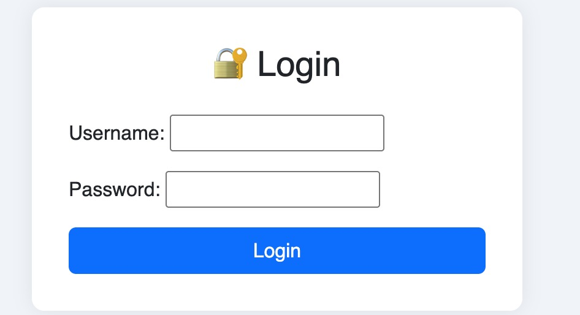
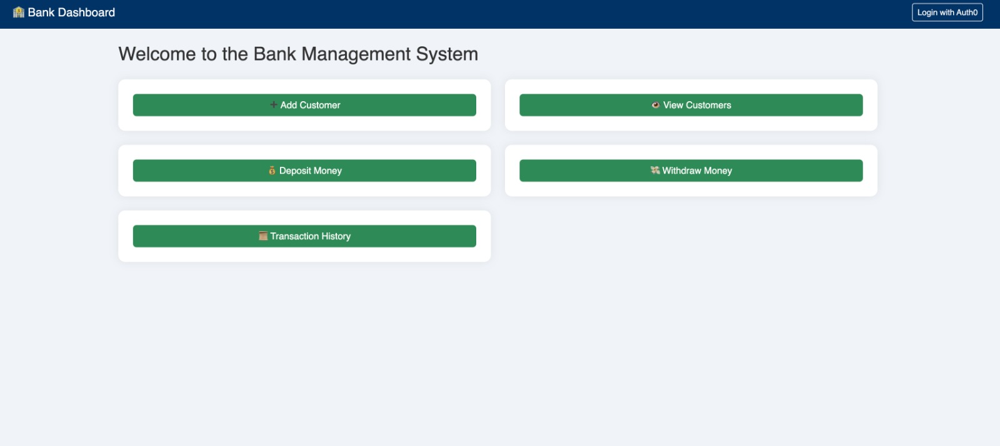
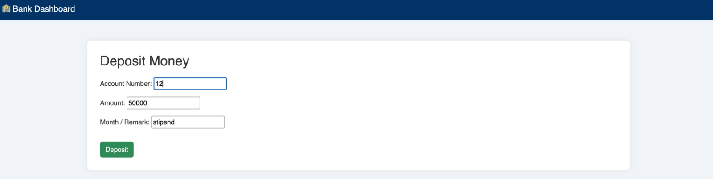
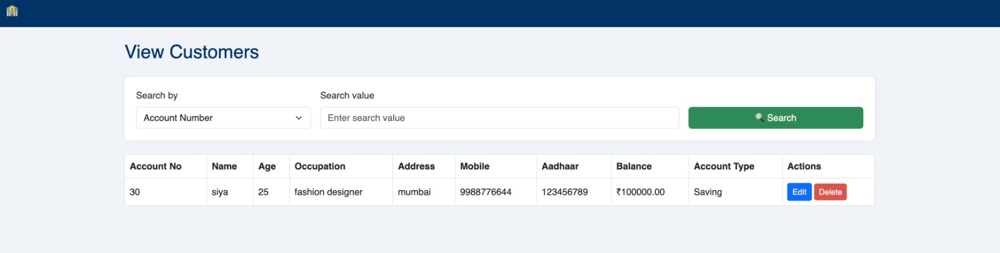
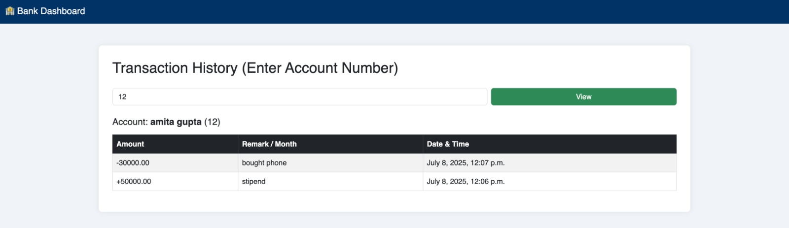

# SMART-BANK-ADMIN-PORTAL

A full-stack web application built using **Django**, **MySQL**, and **Bootstrap**, designed to simulate core banking operations such as adding customers, handling deposits/withdrawals, and viewing transaction history. Includes secure authentication using Django’s built-in auth system (customizable for Auth0 or Clerk).

---

## 🚀 Features

- ✅ User authentication (login/logout) with session handling
- ➕ Add new customers
- 👁️ View all customers
- 💰 Deposit money
- 💸 Withdraw money
- 📜 Transaction history
- 🔐 Login required to access dashboard
- 🎨 Clean Bootstrap-based UI

---

## 🛠 Tech Stack

- **Backend:** Django (Python)
- **Database:** MySQL
- **Frontend:** HTML, CSS (Bootstrap 5)
- **Authentication:** Django Auth (Custom Auth0/Clerk integration possible)
- **Environment Management:** `python-dotenv`

---

## 📸 Screenshots

> Add screenshots inside a `screenshots/` folder in your repo and reference them like below:

### 🔐 Login Page

### 🧮 Dashboard

### 📥 Deposit & Withdraw

### 👥 Customer View

### 🧮 Transaction History

